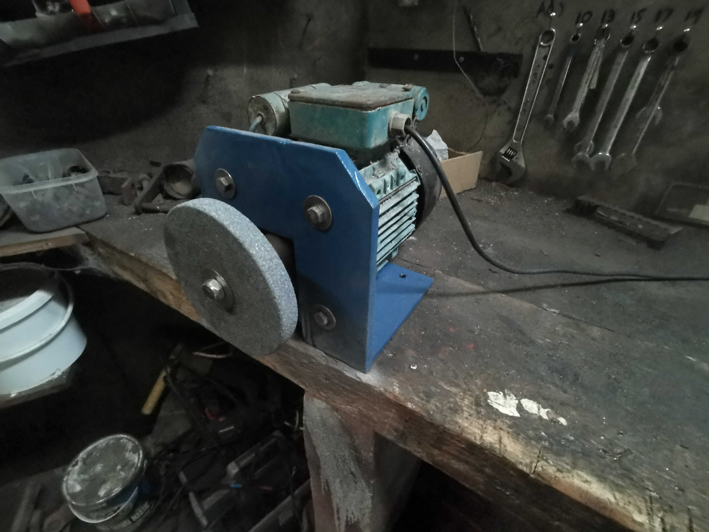

# High-Power-Bench-Grinder
A bench grinder which uses a powerful single phase motor (240VAC 700w @ >1000 RPM) to run a grinding wheel for steel.
A steel frame and coupling was fabricated to mount the motor and wheel.

